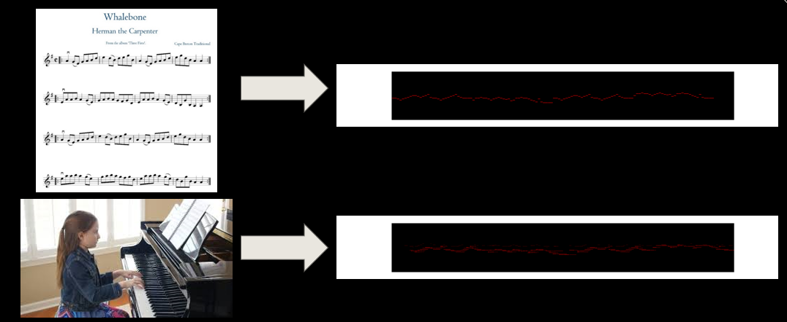
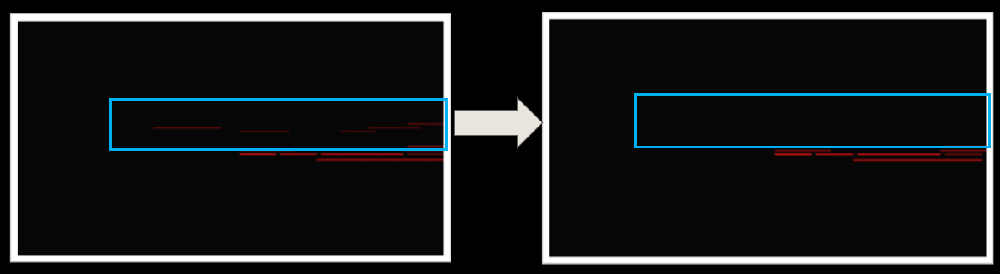
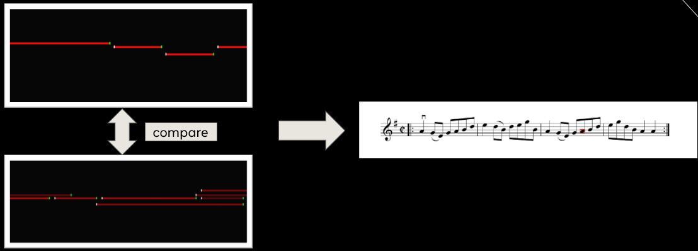
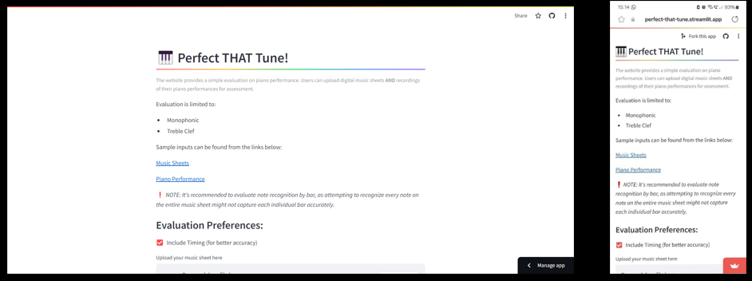

# Undergraduate Dissertation (COMP3024)

# About
Title: Perfect THAT Tune!</br>
Name: Tan En Xuan</br>
Student ID: 20297487</br>
Deployed website: https://perfect-that-tune.streamlit.app

# Introduction
**Perfect THAT Tune!** is a  piano learning website which utilise image processing techniques to visualise user piano performances for evaluation.</br>
The objective of the project are listed below:
1.	Visualise music sheet and user piano performance as piano roll images.

2. Utilise image processing techniques to remove noise, enhance the piano roll images.

3. Develop an algorithm to detect incorrectly played notes by the user.

4. Create an interactive piano learning website available on any devices using Python and deployed via Streamlit.


# Installation Steps
1. Install any Python IDE.**HIGHLY RECOMMENDED PyCharm**</br>
2. Download repository as ZIP file from the link- https://github.com/enxuantan1030/COMP3024_Perfect_THAT_Tune.git </br>
3. Open terminal from IDE. </br>
3. Install necessary libraries by running the command in the terminal  ``` pip install -r requirement.txt``` </br>
4. If the library installation is taking a long time, close the terminal and manually install the libraries inside the requirement.txt. </br>
4. Run the program with the command in the terminal: ``` streamlit run app.py```

# How to use the website?
1. Input your digital music sheet (.jpg/.png/.jpeg) and a recording of your piano performance(.mp3/.wav/.flac)
2. Click on "Evaluate" button.
3. Wait for the results as it may take a long time to process.

# Open-Source Library Used
- [Basic Pitch](https://github.com/spotify/basic-pitch) 
- [SheetVision](https://github.com/cal-pratt/SheetVision)

# Methodology & Algorithm Used to Evaluate Piano Performance
- Image Thresholding
- Contour Detection
- Image Masking
- Pixelation
- Crop and Stretch
- Line Detection in image
- Identify Incorrectly Played Notes

# Python file created
- app.py - to run Streamlit
- midi-to-img.py - to convert MIDI to image
- compare.py - to identify incorrectly played notes
- image_processing.py

# Image created for analysis
- cropped_input_recording_audio_img_bitwise.jpg
- cropped_input_recording_audio_img_cropped_and_stretched.jpg
- cropped_input_recording_audio_img_cropped_rectangle.jpg
- cropped_input_recording_audio_img_detected_lines.jpg
- cropped_input_recording_audio_img_hsv.jpg
- cropped_input_recording_audio_img_morphology.jpg
- cropped_input_recording_audio_img_pixelated.jpg
- cropped_input_recording_audio_img_red_mask.jpg
- cropped_input_recording_audio_img_reduced_noise.jpg
- cropped_input_sheet_sheet_img_bitwise.jpg
- cropped_input_sheet_sheet_img_cropped_and_stretched.jpg
- cropped_input_sheet_sheet_img_cropped_rectangle.jpg
- cropped_input_sheet_sheet_img_detected_lines.jpg
- cropped_input_sheet_sheet_img_hsv.jpg
- cropped_input_sheet_sheet_img_morphology.jpg
- cropped_input_sheet_sheet_img_pixelated.jpg
- cropped_input_sheet_sheet_img_red_mask.jpg
- cropped_input_sheet_sheet_img_reduced_noise.jpg
- overlay.png
- recognized_notes.txt
- red_lines_image_a.txt
- red_lines_image_b.txt
- result.png


# Main libraries used
- OpenCV
- Matlibplot
- Streamlit
- details of libraries used can be found in requirements.txt.

# Future Works
1. Handle polyphonic sheets
2. Implement support for bass clef 
3. Incorporate additional evaluation criteria such as volume and timing

# Contact
:mailbox: Email - hfyet3@nottingham.edu.my</br>
:telephone_receiver: Phone - (+60) 17-2917935</br>
